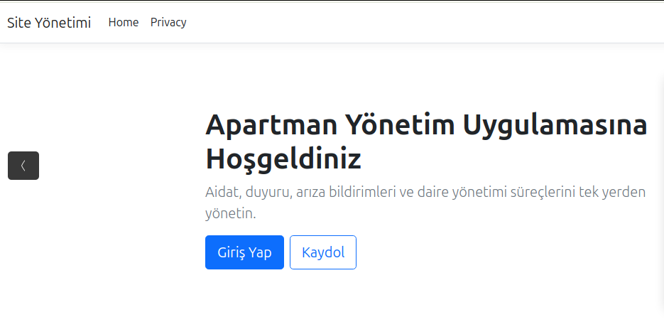
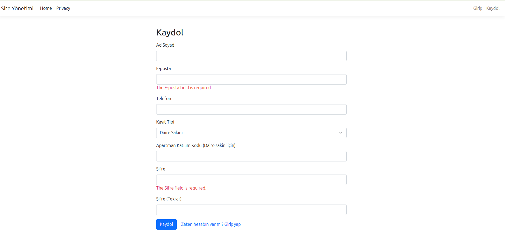
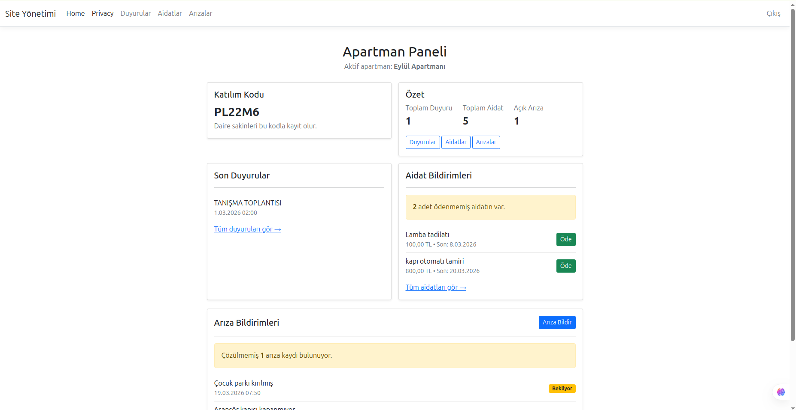
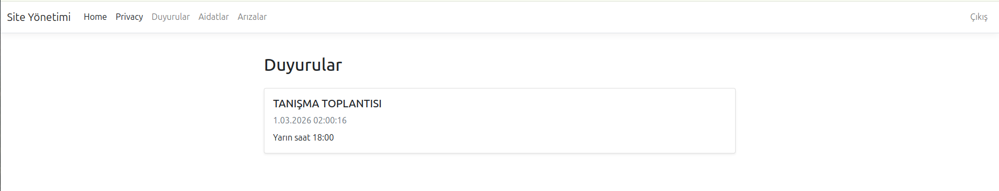
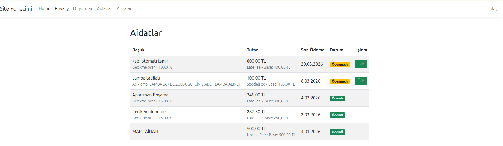
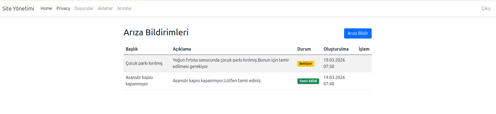

# 🏢 SiteManagement (Site Yönetim Sistemi)

ASP.NET Core ve Clean Architecture yaklaşımı kullanılarak geliştirilmiş, modern bir Site Yönetim Sistemi projesidir.

---

## ✨ Özellikler

* **Aidat Takibi:** Düzenli aidatların oluşturulması ve ödeme durumlarının takibi.
* **Arıza Bildirimi:** Sakinlerin karşılaştığı sorunları yönetime iletebilmesi.
* **Duyuru Sistemi:** Site yönetiminin sakinlere güncel duyurular yayınlaması.

---

## 🛠️ Kullanılan Teknolojiler

* **Dil:** C#
* **Framework:** ASP.NET Core MVC

---

## 📂 Proje Yapısı

Proje, bağımlılıkları en aza indirmek ve sürdürülebilirliği artırmak amacıyla 4 ana katmandan oluşmaktadır:

* 🔹 **SiteManagement.Domain
* 🔹 **SiteManagement.Application
* 🔹 **SiteManagement.Infrastructure
* 🔹 **SiteManagement.Web
---

## 📸 Proje Ekran Görüntüleri

### 🔐 Giriş Ekranı (Login)
Sisteme ilk giriş yapıldığında kullanıcıları karşılayan ekran:

### 📝 Kayıt Olma Ekranı (Register)
Sakinlerin sisteme kayıt olabileceği alan:

### 🏠 Giriş Sonrası Ana Sayfa (Dashboard)
Giriş yapıldıktan sonra sitenin genel durumunu gösteren özet panel:

### 📢 Duyurular Sayfası
Yönetim tarafından paylaşılan güncel duyuruların listelendiği ekran:

### 💳 Aidat Takip Sayfası
Sakinlerin geçmiş ve güncel aidat borçlarını görüp takip edebileceği ve ödeyebileceği ekran:

### ⚠️ Arıza Bildirim Sayfası
Sitedeki teknik veya genel problemlerin yönetime raporlandığı ekran:

---

## Not
Projenin araştırma, geliştirme ve refactoring (kod iyileştirme) süreçlerinde modern yapay zeka araçlarından (ChatGPT) mentorluk ve asistanlık desteği alınmıştır.